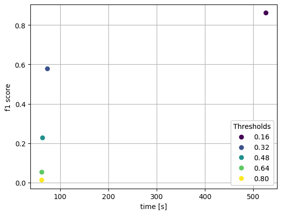
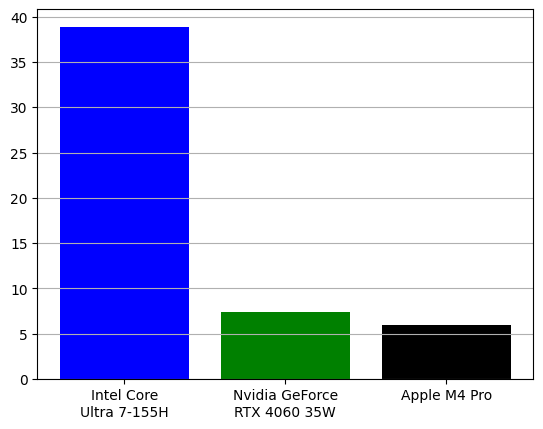

# Dupli-gone
Implementation of deduplication algorithms for scientific documents.

## Dataset
[Dedupe Sweep dataset](https://github.com/IEBH/dedupe-sweep/tree/master/test/data) 

|File                   |records|
|-----------------------|-------|
|cytology-screening.xml | 1 856 |
|haematology.xml        | 1 415 |
|respiratory.xml        | 1 988 |
|stroke.xml             | 1 292 |
|blue-light.xml         | 872   |
|copper.xml             | 505   | 
|diabetes.xml           | 7 236 |
|tafenoquine.xml        | 179   | 
|uti.xml                | 1 043 | 

This dataset includes nine manually labeled reference searches, serving as a reliable ground truth for evaluation. The complete dataset comprises XML files exceeding 85MB in total, with individual files containing between 179 and 7 236 records. This diverse and extensive dataset provides a solid foundation for thoroughly assessing the accuracy and robustness of the deduplication algorithm. 

## Jaccard similarity
In order to use Jaccard similarity as a way of finding duplicates, first analyzed records need to be represented as a set. The chosen way of achieving this result is bi-gram calculation. For each string extracted from the record (title, authors, journal, abstract), set of all possible consecutive two characters was constructed. Then, each pair of records were compared using Jaccard index formula. 

$$J(A,b) = \frac{|A \cap B|}{|A \cup B|}$$

Mean of all values calculated this way served as a similarity metric between two records. As a last step, all records for which Jaccard similarity passed some threshold, were labeled as duplicates. 

### Jaccard Method Performance

On the whole set (c.a. 10 000 records) Jaccard similarity achieved 96% of an accuracy and calculations took 3 minutes.

## MinHash
Jaccard similarity could be expensive if compared sets are huge. In order to reduce a time needed to calculate it, we can make an estimate using MinHash algorithm. We have implemented MinHash version with one hashing function. Each row of the dataset is treated as a set of elements (after deleting NaNs). After that hash() function from the python is used to calculate hashes, and then 11 smallest values are selected. After transforming the whole dataframe to those sets, the following steps are executed for each pair: 

- Selection of 11 lowest hashes from the sum of the sets, 
- Computing intersection of obtained set with starting sets, 
- Calculation of ratio between power of the intersection and 11. 

If the ratio is higher than the given threshold (0.8 in this case), then both sets are treated as duplicates. 

### MinHash method performance

| File          | Accuracy | Precision | Recall | F1 Score | Prediction Time (sec) | Number of Samples |
|---------------|----------|-----------|--------|----------|------------------------|-------------------|
| Tafenoquine   | 0.6480   | 0.6441    | 1.0000 | 0.7835   | 0.0797                 | 179               |
| UTI           | 0.4430   | 0.4052    | 0.9675 | 0.5712   | 2.1759                 | 1043              |
| Diabetes      | 0.5066   | 0.4905    | 0.9561 | 0.6484   | 107.7034               | 7236              |
| Copper        | 0.5545   | 0.5558    | 0.9929 | 0.7126   | 0.5866                 | 505               |
| Blue light    | 0.5573   | 0.5565    | 0.9392 | 0.6989   | 1.6579                 | 872               |

## MinHash with Jaccard similarity
Merged MinHash with Jaccard works as follows:
- An estimate of the Jaccard number is calculated; As a set we treat here row without following columns: caption, label, database, source-app, the k parameter is set to 6. 
- If it is above the selected threshold, then precise Jaccard number is calculated; 
- If that number is bigger than 0.65 (optimal value for Jaccard similarity) then we assume that the article is a duplicate. 

### MinHash with Jaccard method performance
The relation between threshold for MinHash, executaion time and f1-score is present in the picture below.
 

## Embeddings
The deduplication approach works by first converting each text into a dense vector - an embedding - that captures its semantic meaning, then using [FAISS](https://github.com/facebookresearch/faiss), a high-performance similarity search library, to quickly find pairs of embeddings whose cosine similarity (computed as the inner product of normalized vectors) exceeds a chosen threshold. By querying each embedding for its nearest neighbors in the FAISS index and marking any texts whose similarity score is above the cutoff, the method efficiently flags all near-duplicates in a corpus.

Combining the `sentence‑transformers/paraphrase‑MiniLM‑L3‑v2` encoder with a FlatIP FAISS index and batch size of 256, we achieve state‑of‑the‑art deduplication performance at scale. 

### Embeddings method performance 

The presented values were achieved on the whole dataset on **Apple M4 Pro**.

| Accuracy | Precision | Recall | F1 Score | Prediction Time (s) |
|----------|-----------|--------|----------|----------------------|
| 0.92749  | 0.98256   | 0.87043| 0.92310  | 6.00272              |

### Embeddings GPU vs CPU 

Execution time was compared for deduplication using SentenceTransformer with different backends:  

- Cpu, in this case **Intel Core Ultra 7-155H**, 
- CUDA, tested with mobile version of **Nvidia GeForce RTX 4060, 8 GB VRAM, 35W power**, 
- MPS(Metal Performance Shaders) for **Apple M4 Pro**. 

## SemHash
[SemHash](https://github.com/MinishLab/semhash) is a lightweight and flexible tool for deduplicating datasets, filtering outliers, and finding representative samples using semantic similarity. It combines fast embedding generation from Model2Vec with efficient ANN-based similarity search through Vicinity. 

### SemHash method performance

| Method  | Accuracy | Precision | Recall  | F1 Score | Prediction Time (s) |
|---------|----------|-----------|---------|----------|----------------------|
| SemHash | 0.80405  | 0.91553   | 0.66991 | 0.77369  | 2.77785              |

